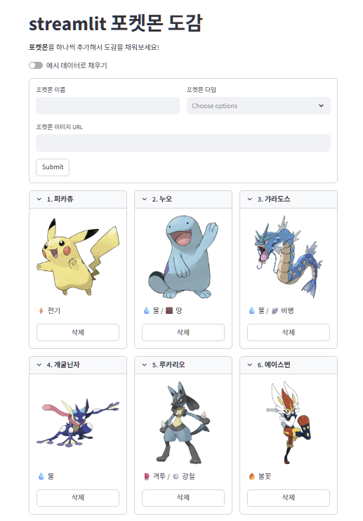

# 🔥 streamlit_pokedex_pratice

⏱ Built in 2 days  
python을 이용한 포켓몬 도감 웹 구현 toy project

## 1. 목적
streamlit 공부

## 2. 주요 기능
- 배치된 위젯을 통해 포켓몬 이름, 타입 확인 가능
- form을 사용하여 추가 포켓몬 데이터 입력가능
- button을 이용한 포켓몬 데이터 삭제 기능

## 3. 화면

## 4. 참고 유튜브
https://www.youtube.com/@firstpenguine-codingschool1

